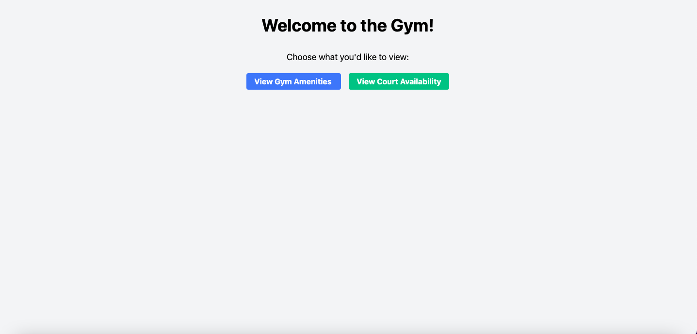
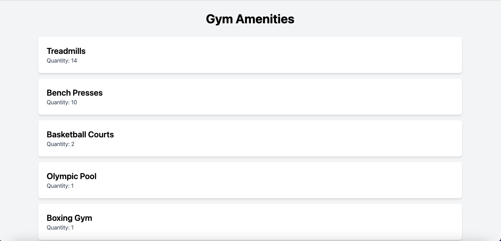
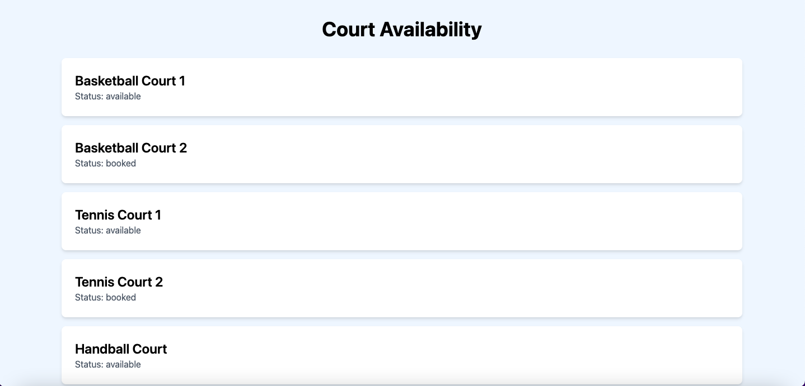

# Gym Amenities

A Python Flask application that allows users to view gym amenities and check court availability. The data is served dynamically from an SQLite database, and the design is styled with Tailwind CSS for responsive layouts.

## Table of contents

- [Technologies](#technologies)
- [Project Structure](#project-structure)
- [Setup Instructions](#setup-instructions)
- [Screenshots](#screenshots)
- [Live Demo](#live-demo)
- [Contact](#contact)

## Technologies

- Python, Flask, SQLite, Tailwind CSS.

## Project Structure

gym_project/  
├── templates/  
│   ├── amenities.html            # Displays gym amenities  
│   └── courts.html               # Displays court availability  
├── app.py                        # Main Flask application with SQLite logic and routes  
├── gym.db                        # SQLite database storing gym amenities and court data  
├── Procfile                      # For deploying to Heroku  
├── requirements.txt              # Python dependencies  
└── venv/                         # Virtual environment (not included in version control)  

## Setup Instructions

1. Clone the repository:

   git clone https://github.com/ibsaajadam/gym-amenities.git

2. Navigate to the project directory:

   cd gym-amenities

3. Set up a virtual environment (optional but recommended):

   python3 -m venv venv
   source venv/bin/activate

4. Install dependencies:

   pip install -r requirements.txt

5. Start the Flask development server:

   python3 app.py

   The app will now be running at http://localhost:5000.

6. Access the app:
   - Home page with buttons: http://localhost:5000/
   - Gym Amenities: http://localhost:5000/amenities
   - Court Availability: http://localhost:5000/courts

## Screenshots

  
  

## Live Demo

View the live demo here: [Live Demo](https://gym-amenities-2bc9d513281c.herokuapp.com/)

## Contact

Created by [Ibsaa J Adam](https://github.com/ibsaajadam) - feel free to contact me!

You can also find me on:

- [LinkedIn](https://www.linkedin.com/in/ibsaajadam/)  
- [GitHub](https://github.com/ibsaajadam)
